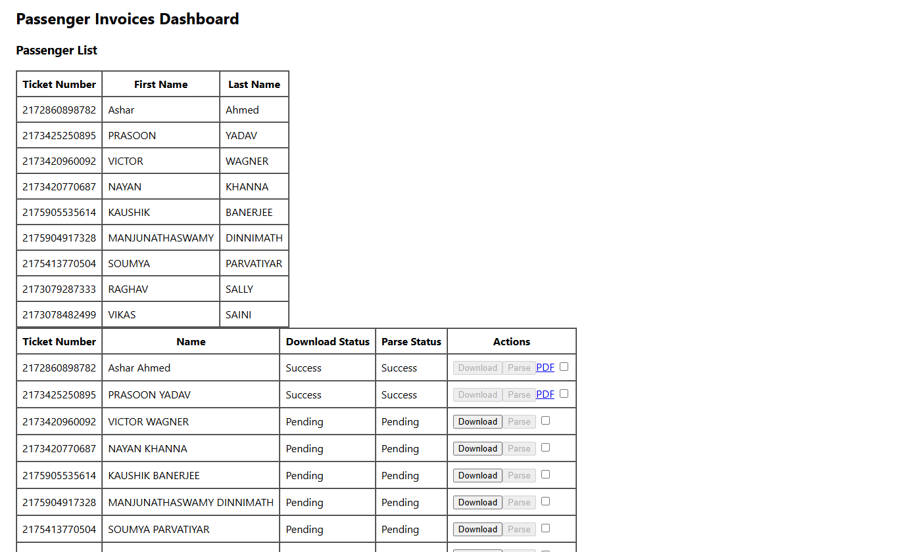
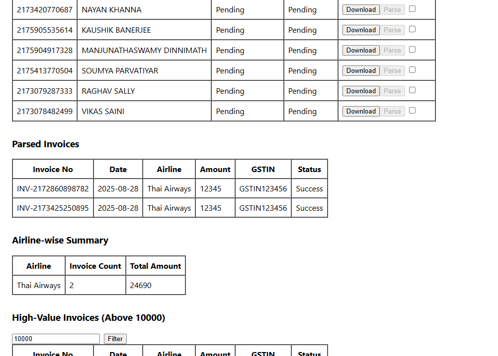
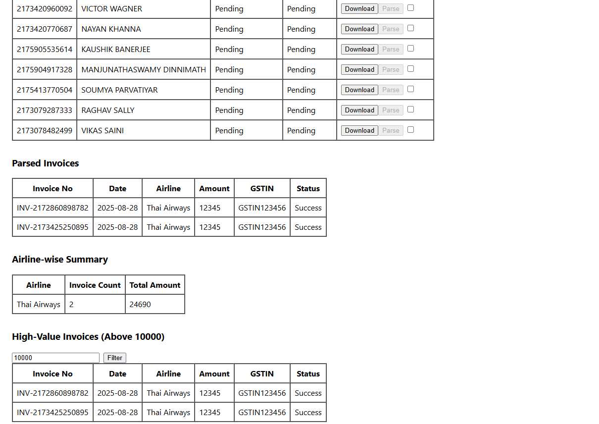

# Invoice Automation App

A full-stack application that automates **downloading airline invoices**, **parsing details**, and providing **summary analytics**.  
Built with **Node.js (Express)** on the backend and **React.js** on the frontend.

---

## ✨ Features
- 📄 **Parse Invoices** to extract structured data (invoice number, date, GST, airline, amount, etc.).
- 📊 **View Parsed Invoices** in a clean React UI.
- 📑 **Summary Reports** by airline and amount.
- ⚡ **High-value Invoice Filtering** with configurable threshold.


## 🚀 Getting Started

### 1. Clone the repo
```bash
git clone https://github.com/harsh11ith/invoice_app.git
cd invoice_app

cd backend
npm install
npm start   # or nodemon server.js (if installed)

cd ../frontend
npm install
npm start


| Endpoint                      | Method | Description                                      |
| ----------------------------- | ------ | ------------------------------------------------ |
| `/`                           | GET    | Get all invoices                                 |
| `/download/:ticketNumber`     | POST   | Download invoice (needs first/last name in body) |
| `/parse/:ticketNumber`        | POST   | Parse downloaded invoice                         |
| `/parsed`                     | GET    | Get all parsed invoices                          |
| `/summary`                    | GET    | Get summary by airline                           |
| `/high-value?threshold=10000` | GET    | Get invoices above threshold                     |
## 📸 Screenshots








